<div align="center">

# luci-app-fm350

**适用于 Fibocom FM350-GL 5G 模组的高性能、现代化 OpenWrt / ImmortalWrt LuCI 管理插件**

[](https://openwrt.org/)
[](https://immortalwrt.org/)
[](https://www.rust-lang.org/)
[-brightgreen.svg?style=flat-square)](https://github.com/openwrt/luci)
[](#)
[](LICENSE)

**Rust 单静态二进制** • **无 Python / Lua 后端依赖** • **串口排他持久持有** • **纯原生 LuCI JS**

---

</div>

> [!CAUTION]
> ### ⚠️ 开发中预警与免责声明 (Under Active Development)
>
> **本项目当前仍处于高频开发与实机验证阶段，暂不保证功能的完整性、稳定性与可用性。**
> - 部分功能与命令可能存在未预期 Bug，且底层接口可能随开发推进发生破坏性变更；
> - **强烈建议勿直接用于关键生产环境或主干业务网关**；
> - 欢迎在测试环境中试用，若遇到异常问题，请提交 Issue 并附带 `logread` 与 `fm350d status` 调试回执。

---

## 目录

- [快速开始](#快速开始)
- [界面预览](#界面预览)
- [核心定位与架构概览](#核心定位与架构概览)
- [功能特性清单](#功能特性清单)
- [状态仪表盘与派生算法](#状态仪表盘与派生算法)
- [菜单路由与仓库结构](#菜单路由与仓库结构)
- [系统架构与数据流](#系统架构与数据流)
- [EIF 兜底加速（可选增强）](#eif-兜底加速可选增强)
- [IMEI / 串号安全体系](#imei--串号安全体系)
- [UCI 配置全景参考](#uci-配置全景参考)
- [CLI 命令行运维速查](#cli-命令行运维速查)
- [交叉编译与构建指引](#交叉编译与构建指引)
- [部署验证与验收清单](#部署验证与验收清单)
- [深度踩坑与技术避坑指北](#深度踩坑与技术避坑指北)
- [架构设计取舍与考量](#架构设计取舍与考量)

## 快速开始

适合已经在 OpenWrt / ImmortalWrt 上使用 **Fibocom FM350-GL** 的用户：用一个 LuCI 页面集中完成状态查看、拨号配置、锁频锁小区、短信收发、AT 调试和基础维护。后端为 `fm350d`，安装后通过 procd 服务常驻运行。

### 适用范围

| 项目 | 说明 |
| :--- | :--- |
| 目标模组 | Fibocom FM350-GL |
| 目标系统 | OpenWrt 24.10+、ImmortalWrt 24.x / 25.x 及相近 LuCI JS 环境 |
| 前端入口 | `网络 -> Mobile Network -> FM350-GL` |
| 后端服务 | `/etc/init.d/fm350d`，二进制位于 `/usr/sbin/fm350d` |
| 配置文件 | `/etc/config/fm350` |
| 默认 AT 口 | `/dev/ttyUSB1`，可在服务设置页重新探测和修改 |

### 安装与启动

优先从 GitHub Releases 下载与固件包管理器匹配的安装包：

```bash
# ImmortalWrt 25.x / OpenWrt 24.10+ 常见 apk 固件
apk add --allow-untrusted luci-app-fm350-*.apk

# 传统 opkg 固件
opkg install luci-app-fm350_*.ipk

# 清理 LuCI 缓存并重载 rpcd
rm -f /tmp/luci-indexcache*
rm -rf /tmp/luci-modulecache/
/etc/init.d/rpcd reload

# 启用并启动服务
/etc/init.d/fm350d enable
/etc/init.d/fm350d start
```

若菜单未立即出现，重新登录 LuCI 或重启 `uhttpd` 后再访问。

### 运行依赖与边界

- 软件包依赖 `luci-base`、`rpcd-mod-ucode`、`kmod-usb-net-rndis`、`kmod-usb-serial-option`，由包管理器处理。
- `fm350d` 是 Rust 静态二进制，不依赖 Python、Lua 后端脚本或额外 Web 服务。
- 面向 FM350-GL 实机行为实现，不保证直接适配其它 T700 / 5G 模组。
- IMEI 写入默认关闭，需同时开启 UCI 开关和二次确认；普通状态查看、拨号、短信、锁频不需要该开关。

## 界面预览

截图取自真实设备（ImmortalWrt SNAPSHOT + FM350-GL，Aurora 主题），每页自上而下整页分段截取。涉及身份、链路与基站位置的字段在截图**之前**替换为 `[已脱敏]`：IMEI、序列号、IMSI、ICCID、短信中心、蜂窝 IPv4/IPv6 与 DNS、小区 ID（ECI/NCI）、LAC/TAC、PCI、频点 ARFCN。保留公开的频谱与信号质量指标（接入制式、频段、带宽、RSRP/RSRQ/SINR、模组温度）与设备节点，它们不含位置信息。

### 模组状态

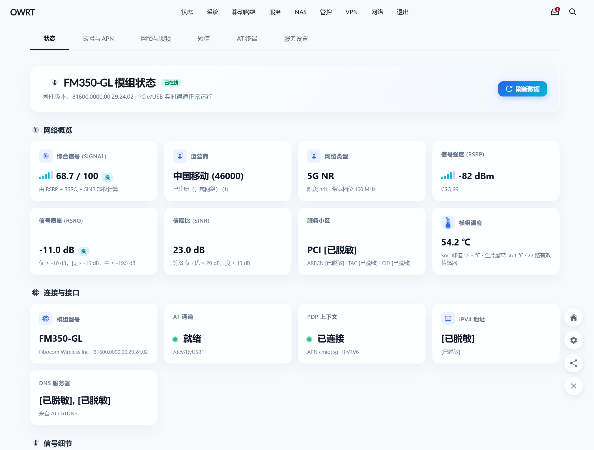

标题头与「网络概览」8 张核心卡片：综合信号评分、运营商与注册状态、接入制式与频段带宽、RSRP、RSRQ、SINR、服务小区参数、模组温度。

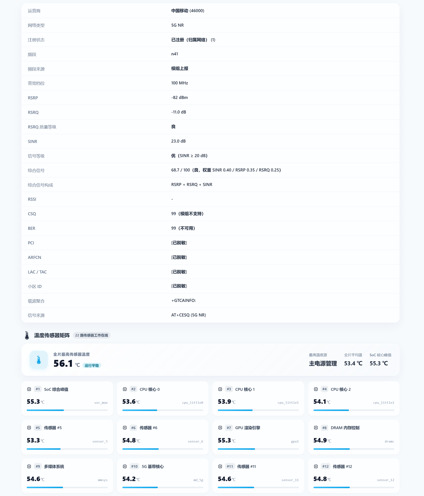

「连接与接口」余下卡片与「信号细节」全表（PCI、ARFCN、LAC/TAC、小区 ID 均已脱敏），下方是温度传感器矩阵前 12 路。

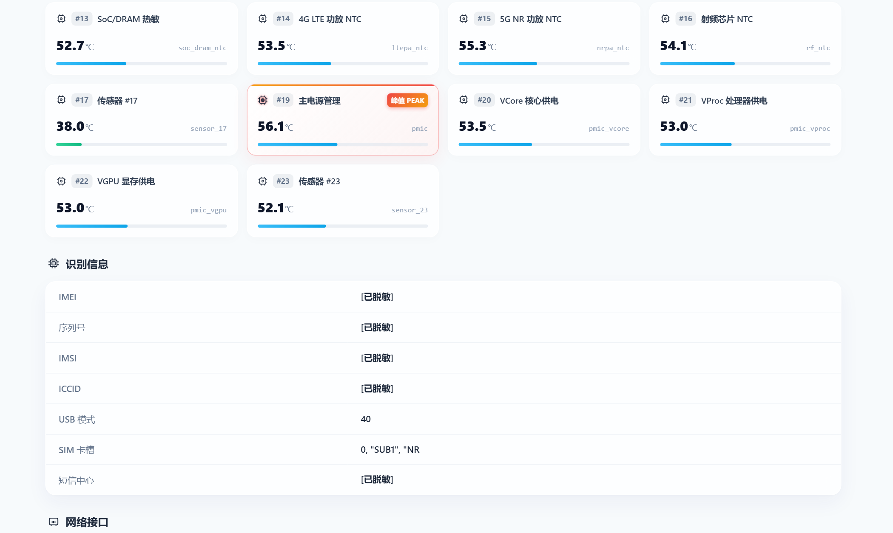

温度矩阵余下通道与「识别信息」表。模组共 23 路硬件传感器，读数为 0 的通道视为未装配、不列入活跃列表（本机 22 路有效，第 18 路为 0，故编号从 #17 跳到 #19）；峰值通道单独标记 PEAK。

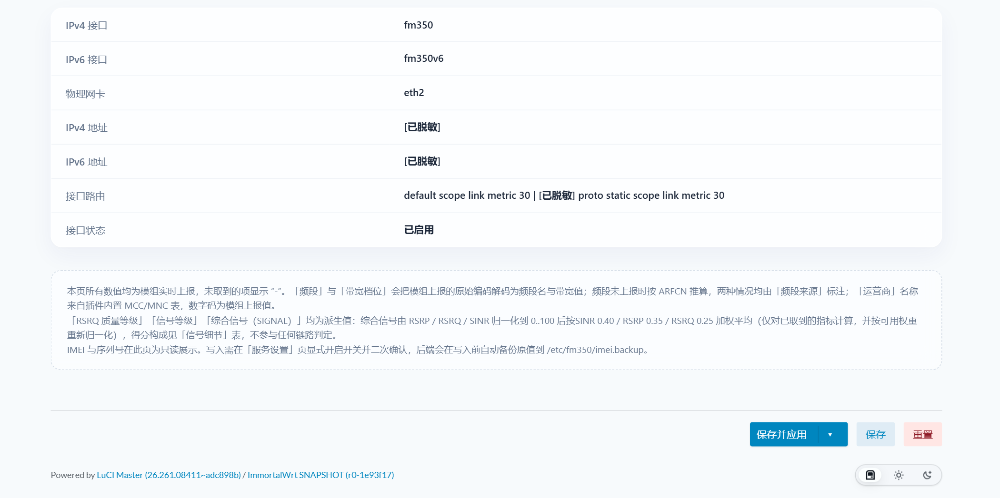

「网络接口」表（接口名、物理网卡、地址与路由）与页面底部口径说明。

### 拨号与 APN

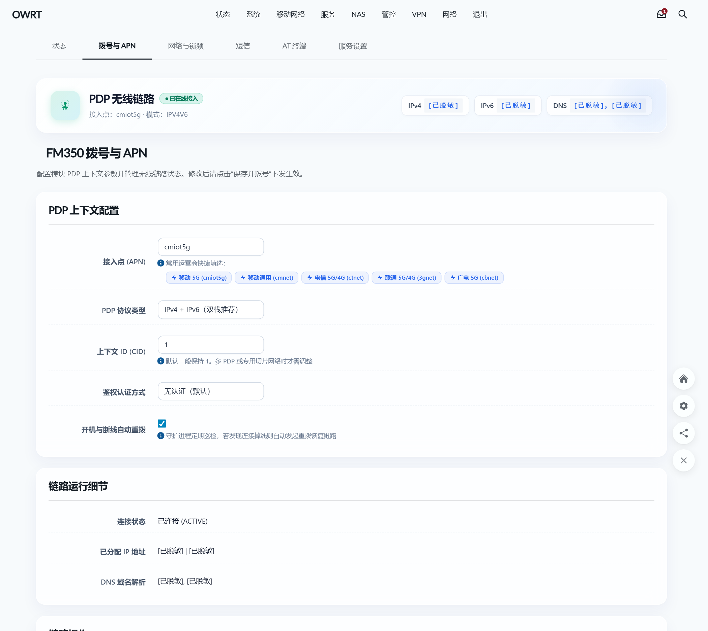

PDP 无线链路状态、上下文配置（APN、运营商快捷填选、双栈协议选择）、链路运行细节。


链路操作区：立即拨号、保存并拨号、断开连接。

### 网络与锁频

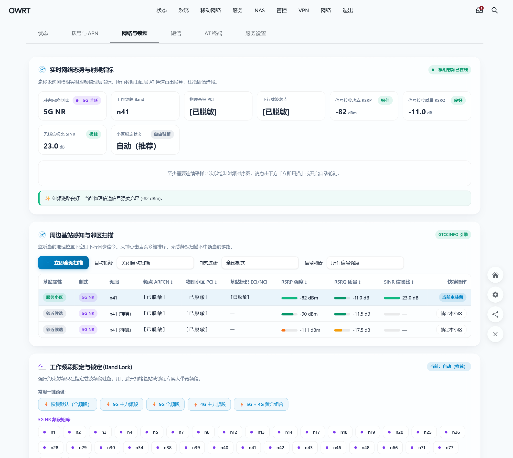

实时网络态势与射频指标、周边基站感知与邻区扫描（信号强度分档着色）、工作频段限定与锁定（Band Lock）及 5G NR 频段矩阵。

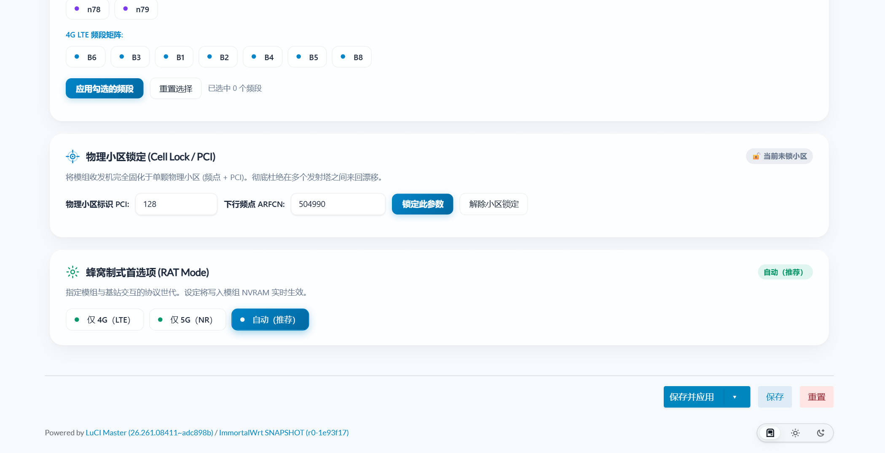

物理小区锁定（Cell Lock / PCI）与蜂窝制式首选项（RAT Mode）。

### 短信

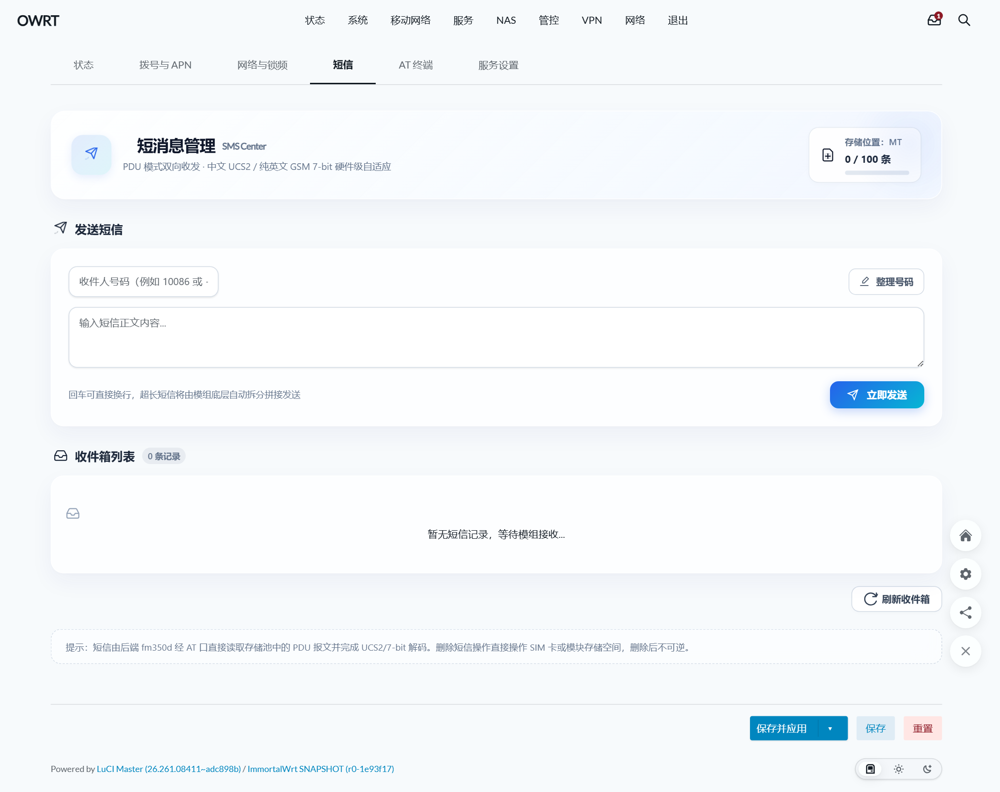

存储位置与容量、发送短信（收件人、正文、超长短信自动拆分）、收件箱列表与刷新。

### AT 终端

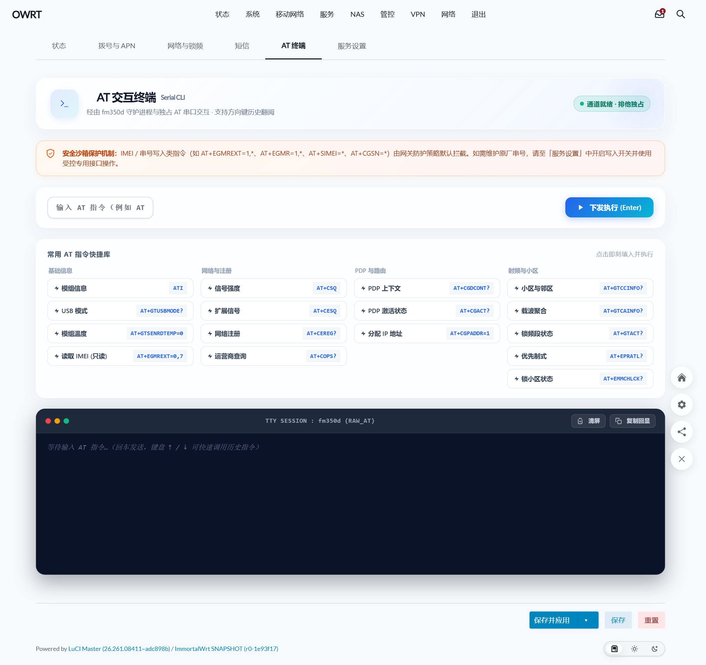

安全沙箱提示、命令输入与回显、常用 AT 指令快捷库（四类分组，点击即填入）、TTY 会话窗口与历史翻阅。

### 服务设置

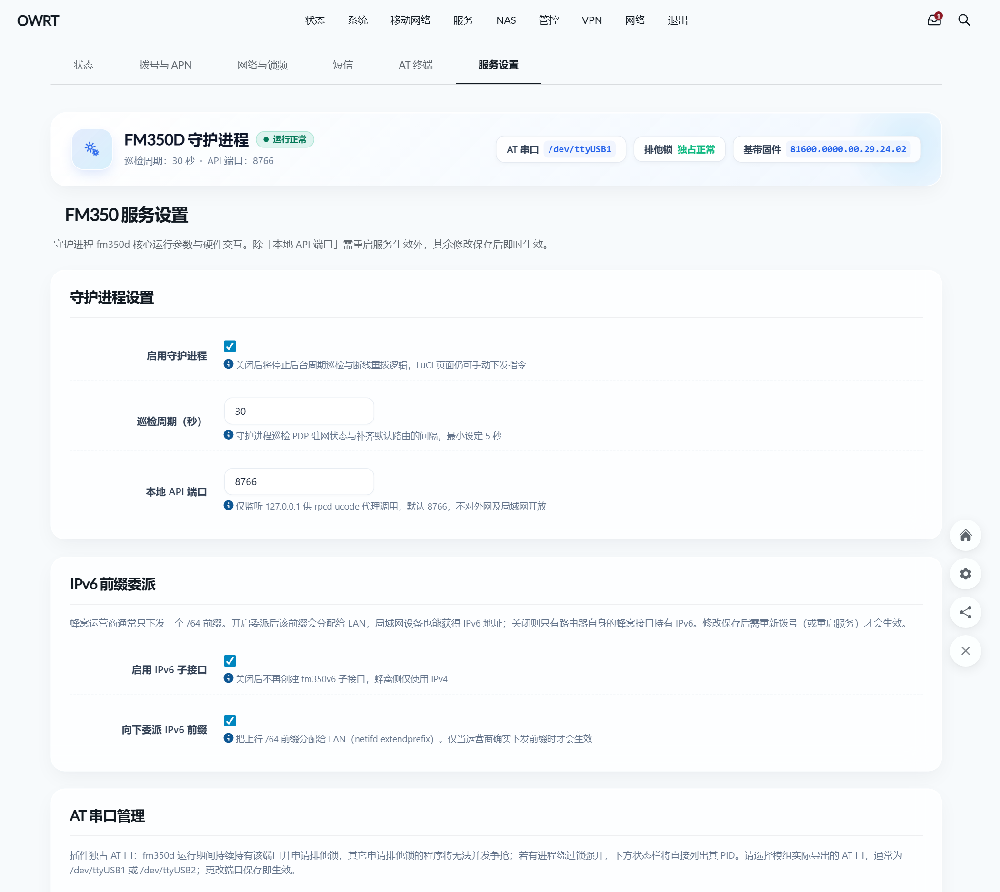

守护进程设置、IPv6 接口、AT 串口管理与占用探测。

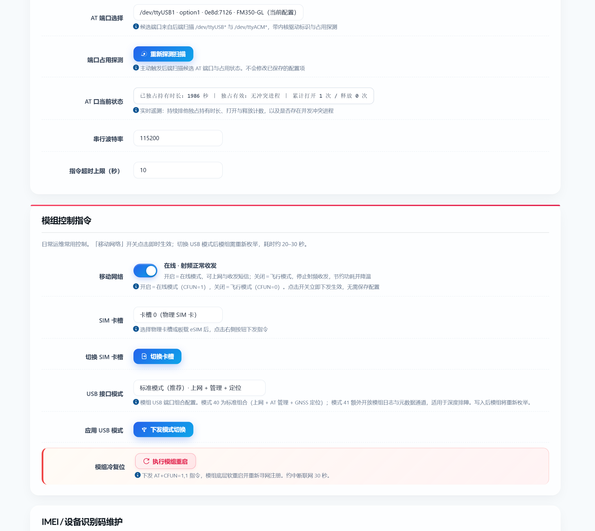

模组控制指令：日常运维动作（移动网络开关、重启、复位等）。

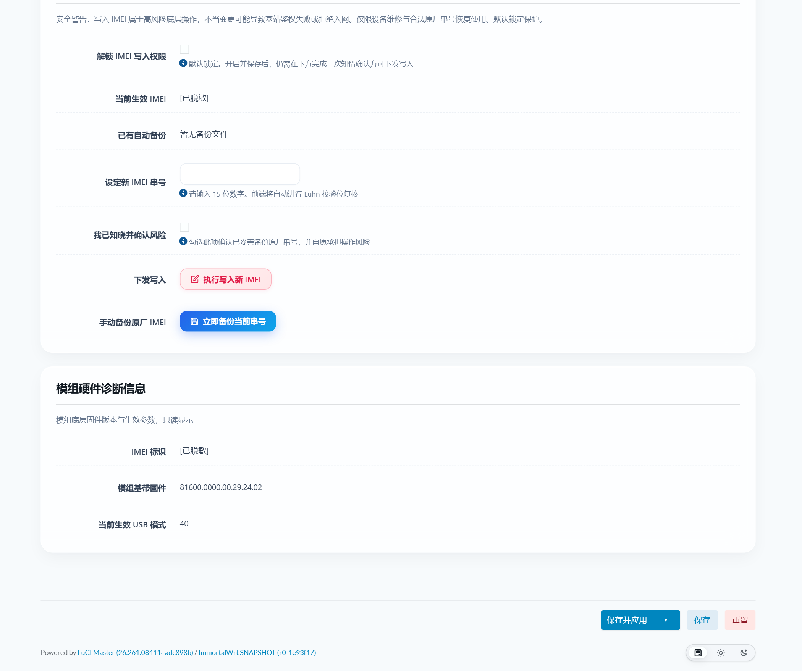

IMEI / 设备识别码维护（默认锁定，需二次确认后方可写入）与模组硬件诊断信息。

## 核心定位与架构概览

- **Rust 单二进制后端 (`fm350d`)**：单一可执行文件运行于 `/usr/sbin/fm350d`，无 Python / Lua 运行时依赖，不引入额外 Web 守护进程。
- **原生 LuCI JS 前端**：全基于 `view/form` 与独立 CSS 样式表，不使用内联样式，不使用已废弃的 Lua 页面与控制器。
- **严格串口独占持有**：持久持有 + 排他文件锁，杜绝频繁开关串口的握手开销；辅以进程级 `/proc/*/fd` 扫描，独占状态真实可观测。
- **精简系统集成**：经标准 `/usr/share/rpcd/ucode/fm350.uc` 提供 ubus 代理，无额外 HTTP 守护进程，不占用独立网络端口。
- **规范配置管理**：统一纳入 OpenWrt 原生 UCI 体系（`/etc/config/fm350`，section `main`）。

## 功能特性清单

| 业务领域 | 具体能力 |
| :--- | :--- |
| 模组识别 | 厂商、型号、固件版本、IMEI、序列号 (SN)、IMSI、ICCID、USB 模式、SIM 卡槽状态、短信中心 (SMSC) |
| 网络状态 | 注册状态、运营商名称与代号、接入制式 (NR/LTE)、RSRP / RSRQ / SINR、频段 / PCI / ARFCN / TAC / 小区 ID、载波聚合 (CA) |
| 温控监测 | 5G 基带核心温度 (`md_5g`)、SoC 峰值温度、全量 23 路独立硬件传感器明细（读数为 0 视为未装配，不计入活跃列表） |
| 蜂窝拨号 | APN 配置、PDP 协议 (IPv4/IPv6/IPv4v6)、CID、认证协议、状态侦测、实时 IPv4/IPv6 地址与 DNS 提取 |
| 路由守护 | 自动配置 IPv4 `/32` 静态接口与 IPv6 `/128` 静态子接口（地址取自模组侧 AT+CGPADDR，不依赖 RA/DHCPv6），自愈补齐缺失的默认路由 (`onlink`)，支持 Metric 跃点微调 |
| 锁网锁频 | `AT+GTACT` 频段与制式锁定、`AT+EMMCHLCK` 物理小区 (PCI) 锁定、指定网络搜索优先级 |
| 短信中心 | 规范 PDU 编解码（中文 UCS2、英文 GSM 7-bit 自动适配）、收件箱列表、单条/批量删除、存储容量查询 |
| 硬件控制 | 软件重启模组、飞行模式与在线模式切换、实体双 SIM 卡槽软件倒换、USB 复合模式调整 |
| IMEI 管理 | 串号读取、出厂原始数据镜像备份、受控安全写入（15 位格式校验与双重确认锁，Luhn 仅提示） |
| 交互终端 | 网页端内置交互式 AT 透传终端，安全半双工通信，拦截越权破坏性指令 |
| 智能串口 | 自动枚举探测 `/dev/ttyUSB*` 与 `/dev/ttyACM*`，呈现驱动内核信息、VID:PID，高亮识别 Fibocom 候选口 |

## 状态仪表盘与派生算法

### 首屏 8 张核心卡片

「状态 -> FM350-GL」首屏前置高频网络指标卡片：

| 卡片名称 | 主显数值 | 辅助说明 |
| :--- | :--- | :--- |
| **综合信号（SIGNAL）** | 信号条 + `63.1 / 100` + 等级标签 | 参与合成计算的指标项（如 `RSRP + RSRQ + SINR`） |
| **运营商** | `中国移动 (46000)` | 注册状态与漫游标识 |
| **网络类型** | `5G NR` | 频段名与带宽（如 `n41` / `100 MHz`，模组原始拼接编码由后端解码） |
| **信号强度（RSRP）** | 信号条 + `-81 dBm` | 模组原始 `RSSI … dBm` 及兼容标识 `CSQ 99` |
| **信号质量（RSRQ）** | `-11.0 dB` + 质量标签 | 质量门限：优 >= -10 dB、良 >= -15 dB、中 >= -19.5 dB |
| **信噪比（SINR）** | `15.0 dB` | 等级门限：优 >= 20 dB、良 >= 13 dB |
| **服务小区** | `PCI 128` | `ARFCN` / `TAC` / `CID` |
| **模组温度** | `45.5 ℃`（`md_5g`） | SoC 核心峰值 / 全片最高温 / 活跃传感器路数 |

页面下方依次为：连接与接口 -> 信号细节 -> 温度传感器（23 路）-> 模组识别信息 -> 网络接口状态。

### 派生指标计算模型

> [!NOTE]
> 派生指标**仅用于前端可视化呈现**，**不参与任何内核链路判断与路由决策**。

**1. RSRQ 质量等级**：优 >= -10 dB；良 >= -15 dB；中 >= -19.5 dB；差 < -19.5 dB。

**2. 信号质量等级**：首选 SINR 判定（>= 20 优 / >= 13 良 / >= 0 中 / < 0 差，单位 dB）；无 SINR 上报时退回 RSRP（>= -80 优 / >= -90 良 / >= -100 中 / < -100 差，单位 dBm）。

**3. 综合信号评分**：三项指标分别线性归一化至 0~100 后加权：

```text
SIGNAL = 0.40 x SINR_norm + 0.35 x RSRP_norm + 0.25 x RSRQ_norm
```

| 指标 | 标称区间 | 归一化公式 |
| :--- | :--- | :--- |
| RSRP | -140 ~ -44 dBm | `(v + 140) / 96 x 100` |
| RSRQ | -19.5 ~ -3 dB | `(v + 19.5) / 16.5 x 100` |
| SINR | -23 ~ 30 dB | `(v + 23) / 53 x 100` |

- 超出标称区间自动截断（Clamp）至 0 或 100；得分越高信号条点亮格数越多（>= 80 为 5 格，随后每 20 分递减 1 格，0 分 0 格）。
- **缺失指标智能重归一化**：LTE 下缺 SINR 时自动剔除该项，剩余指标按权重比例重归一化，避免缺项导致整体得分被系统性拉低；后端回传 `overall_used` 标明参算指标。

## 菜单路由与仓库结构

菜单入口：`网络 (Network) -> 移动网络 -> FM350-GL`。菜单在 `/usr/share/luci/menu.d/luci-app-fm350.json` 中声明，父节点 `admin/modem/fm350` 为 `firstchild`，六个子节点自动渲染为页面顶部 Tab 切换条。

> 一级菜单 `admin/modem` 的 `title` 自 1.0.8 起直接写中文 `移动网络`。本仓库没有 i18n 资源（无 `.po` / `.lmo`，Makefile 不走 `luci.mk`），若这里保留英文 msgid，则**单独安装本插件**时该菜单恒为英文 —— LuCI 在客户端渲染菜单时调 `_(title)`，没有语言目录时原样返回 msgid（详见 CHANGELOG 1.0.8）。代价是英文环境下该菜单也显示中文。若该菜单键被其他自带语言包的插件重复定义，则由对方覆盖并同样显示中文。

| 选项卡 | 访问路由 | 说明 |
| :--- | :--- | :--- |
| 状态 | `/cgi-bin/luci/admin/modem/fm350/status` | 8 张仪表盘卡片、频段详情、温度传感器明细 |
| 拨号与 APN | `/cgi-bin/luci/admin/modem/fm350/dial` | PDP 协议、APN、CID 及拨号控制表单 |
| 网络与锁频 | `/cgi-bin/luci/admin/modem/fm350/network` | 邻区扫描、频段锁定、小区/PCI 锁定、制式选择 |
| 短信 | `/cgi-bin/luci/admin/modem/fm350/sms` | PDU 短信收发、草稿与存储清理 |
| AT 终端 | `/cgi-bin/luci/admin/modem/fm350/at` | 交互式命令行，内置危险指令拦截 |
| 服务设置 | `/cgi-bin/luci/admin/modem/fm350/settings` | 守护参数、串口重新探测、IMEI 权限控制 |

### 仓库目录结构

```text
luci-app-fm350/
├── Makefile                                 # 打包与 Rust 交叉编译集成配方
├── README.md / CHANGELOG.md                 # 项目文档与版本日志
├── .github/workflows/
│   ├── ci.yml                               # 静态门禁 + Rust 单测（推送 / PR 触发）
│   └── release.yml                          # 自动化发布流水线（tag 或手动触发）
├── scripts/
│   └── build-release.sh                     # 基于官方 SDK 的发布构建脚本
├── htdocs/luci-static/resources/
│   ├── fm350/api.js                         # 前端统一 RPC 客户端
│   ├── fm350/css/fm350.css                  # 独立样式表（严禁内联 CSS）
│   └── view/fm350/                          # LuCI JS 页面视图
│       ├── status.js / dial.js / network.js # 状态 / 拨号 / 邻区与锁频
│       └── sms.js / at.js / settings.js     # 短信 / AT 终端 / 设置
├── root/
│   ├── etc/
│   │   ├── config/fm350                     # 默认 UCI 配置
│   │   ├── init.d/fm350d                    # procd 自启脚本
│   │   └── uci-defaults/99-fm350-network    # 首次启动网络骨架注入
│   └── usr/share/
│       ├── luci/menu.d/luci-app-fm350.json  # 菜单节点注册
│       └── rpcd/
│           ├── acl.d/luci-app-fm350.json    # RPCD 鉴权 ACL
│           └── ucode/fm350.uc               # ucode 代理层（UBUS 桥接 fm350d CLI）
└── rust/                                    # fm350d 核心后端 (Rust 2021)
    ├── Cargo.toml / .cargo/config.toml      # 依赖声明与交叉链接器配置
    └── src/
        ├── at.rs / config.rs                # 串口持有与 AT 通道 / UCI 读写（2s 缓存）
        ├── modem.rs / sms.rs / imei.rs      # 信号与温度 / PDU 编解码 / IMEI 防护
        ├── net.rs / api.rs / main.rs        # 网络同步与路由自愈 / 本地 JSON-RPC / 守护主循环
```

> [!IMPORTANT]
> **仓库规范**：
> 1. **文本文件行尾必须为 LF**（`.gitattributes` 的 `* text=auto eol=lf` 保证）。若 `/etc/init.d/fm350d` 含 CRLF，procd 将报错 `can't open /etc/rc.common`。
> 2. **执行权限保留**：`root/etc/init.d/` 与 `scripts/` 下的脚本在 Git 索引中必须带 `100755` 权限位。

## 系统架构与数据流

### 通信拓扑结构

```text
┌─────────────────────────────────────────────────────────────┐
│                       Web 浏览器 (LuCI)                     │
│             resources/fm350/api.js (统一 RPC 调度)          │
└──────────────────────────────┬──────────────────────────────┘
                               │  uhttpd / ubus JSON-RPC
                               ▼
┌─────────────────────────────────────────────────────────────┐
│             rpcd 代理插件 (/usr/share/rpcd/ucode/fm350.uc)  │
│              - 负责参数检验与单引号指令转义                  │
│              - 桥接并分发给后台 CLI 工具                     │
└──────────────────────────────┬──────────────────────────────┘
                               │  exec: fm350d <cmd>
                               ▼
┌─────────────────────────────────────────────────────────────┐
│                  fm350d (Rust 高性能守护服务)               │
│  - 维持 127.0.0.1:8766 本地高速 API 通信通道                │
│  - 串口持久持有 + 半双工 AT 互斥队列调度                    │
│  - Linux 系统默认路由守护检测                               │
└──────────────────────────────┬──────────────────────────────┘
                               │  /dev/ttyUSBx (ioctl + flock 独占持有)
                               ▼
┌─────────────────────────────────────────────────────────────┐
│                Fibocom FM350-GL 硬件模组                    │
└─────────────────────────────────────────────────────────────┘
```

### AT 串口独占与主动可观测机制

1. **AT 口独占（整个运行期持续持有）**：
   - 排他锁：端口以 `exclusive(true)` 打开，执行 `ioctl(TIOCEXCL)` + 排他 `flock`。`flock` 是建议锁，凡同样申请锁的程序（端口探测、第二个 `fm350d` 实例）会被拒绝（`EWOULDBLOCK`）；`TIOCEXCL` 是内核级排他，但对持 `CAP_SYS_ADMIN` 的进程无效——OpenWrt 上几乎一切程序都以 root 运行，它挡不住外部未加锁的 root 进程。
   - 主动观测：系统通过 `other_openers()` 扫描 `/proc/*/fd`，检查除自身外还打开该 TTY 的外部进程，并在 Web 界面实时告警。
2. **持有生命周期**：首次操作懒加载打开，此后持有到进程退出，消除反复开关串口的握手开销；仅在串口读写破损异常或配置修改 `at_port` 时释放。
3. **配置热重载（零重启）**：每次 AT 操作先比对持有路径与配置项，不一致当场切换端口；守护内置 2 秒配置原子缓存，改 APN 或开关免重启生效。
4. **拨号与路由守护**：FM350 的 RNDIS 通道不提供 DHCP，IPv4 必须静态 `/32`；netifd 不会为无网关接口下发设备路由，守护周期补齐 `default dev <dev> metric <metric> onlink`。

## EIF 兜底加速（可选增强）

1.0.12 起守护在 AT 口读取路径上被动识别 `+GT*` 形态 URC —— 这是 F22 语义代理
**f22-atproxy**（随修改版 root.squashfs 提供，订阅模组 EIF_IND 降维输出）注入的
事件流。

**设计原则：EIF 为兜底，不是依赖。** 未刷修改 rootfs 的设备上永远没有 `+GT*`
事件，拦截层零开销直通，拨号巡检轮询 `AT+CGPADDR` 核对地址并下发的主线行为与
旧版本完全一致；刷入后获得的是「模组侧地址变化 → 本机秒级感知复核」的加速，
而不是新功能开关。

| URC | 含义 | 守护动作 |
| :--- | :--- | :--- |
| `+GTNORA: initial/refresh` | 模组侧 RA 缺失/刷新 | 记录状态；触发下一轮巡检提前 |
| `+GTIFMTU: <n>` | MTU 变更 | 记录状态 |
| `+GTIFST: cause=<n>` | 接口状态变化 | 记录状态 |
| `+GTIFADDR: <verb>,cause,v4cnt,v6cnt` | 地址事件汇总 | 记录状态；`ipadd`/`ipdel` 触发巡检提前（冷却 60 s） |
| `+GTIFADDR4: <a.b.c.d>` / `+GTIFADDR6: <v6>` | 具体地址（每地址一行） | 记录进模组侧地址快照 |
| `+GTIFEVT: <reason>,cause=<n>` | 兜底未知事件 | 记录状态 |

要点：

- **V4 配置保证**：本机 WAN V4 的唯一配置主线是拨号巡检（`AT+CGPADDR` 判定 +
  `ensure_iface` 下发 + 网关实测），EIF 的 V4 地址只作为「模组侧发生了什么」的
  状态参考与触发信号，不直接写入接口 —— 模组内部 netif 地址与本机 WAN 地址
  不是同一回事，直接照抄会配错。两条路径殊途同归：没刷 rootfs 靠轮询保证，
  刷了 rootfs 事件驱动让复核从最长一个 `poll_interval` 缩短到秒级。
- 可用 `eif_guard=0` 关闭；`/api/eif` 暴露事件计数、最近事件、模组侧地址快照。
- atproxy 的构建、注入与 URC 输出协议详见仓库内 `f22-atproxy/README.md`。

## IMEI / 串号安全体系

> [!WARNING]
> 修改设备 IMEI 涉及底层射频配置与合规性，不当修改可能导致模组无法在公网注册，部分地区受法律约束。**仅供设备维护与原厂数据恢复使用。**

写入链路内置四道防线，逐条通过才放行：

1. 校验 UCI 开关 `imei_write == 1`（默认 0，直接拒绝）；
2. 请求必须携带 `confirm=1` 确认标；
3. 15 位纯数字格式校验（Luhn 校验仅提示，不阻断）；
4. 先备份当前串号到 `/etc/fm350/imei.backup`，再原子写入并立即回读校验，写入动作记录 syslog 审计日志。

| 运维操作 | 触发条件 | 终端命令 |
| :--- | :--- | :--- |
| 读取 | 始终可用（`AT+EGMREXT=0,7`） | `fm350d imei read` |
| 备份 | 始终可用，写入 `/etc/fm350/imei.backup` | `fm350d imei backup` |
| 写入 | `imei_write=1` + `confirm=1` + 15 位格式校验 | `fm350d imei write <15 位> --confirm` |

> 透传 AT 终端中的写入指令同样被强制拦截（`AT+EGMREXT=1,*`、`AT+EGMR=1,*`、`AT+SIMEI=`、`AT+CGSN=` 一律拒绝）。

## UCI 配置全景参考

配置文件 `/etc/config/fm350`（配置段 `main`）：

| 配置键 | 默认值 | 说明 |
| :--- | :--- | :--- |
| `enabled` | `1` | 是否开启后台常驻守护服务 |
| `at_port` | `/dev/ttyUSB1` | AT 串口节点（必须绝对路径） |
| `baudrate` | `115200` | 串口波特率 |
| `at_timeout` | `10` | 单条 AT 指令交互超时（秒） |
| `apn` | `cmiot5g` | 蜂窝接入点名称 (APN) |
| `pdp_type` | `IPV4V6` | PDP 协议：`IP` / `IPV6` / `IPV4V6` |
| `cid` | `1` | 激活的 PDP Context ID |
| `auth` | `none` | 认证协议：`none` / `pap` / `chap` |
| `iface` | `fm350` | IPv4 接口名（生成于 `/etc/config/network`） |
| `iface_v6` | `fm350v6` | IPv6 接口名（关联 `device=@fm350`；proto 由 `v6_mode` 决定：`none` / `dhcpv6` / `static`） |
| `data_dev` | `auto` | 蜂窝数据通道网卡名，`auto` 依驱动自动探测 |
| `metric` | `30` | 默认路由跃点优先级 |
| `ipv6` | `1` | 是否创建并接管 IPv6 子接口 |
| `extendprefix` | `1` | **插件侧已废弃（1.0.3 起）**，后端不消费此字段；`v6_mode=dhcpv6` 时插件会自动在 `fm350v6` 接口上写入 `extendprefix=1` |
| `auto_dial` | `1` | 服务启动后自动拨号 |
| `route_guard` | `1` | 默认路由自愈守护 |
| `gateway_mode` | `auto` | 网关模式：`auto` 推导并实测同网段 `.1` 网关、失败回退；`static` 用 `gateway`；`off` 无网关 onlink 直连 |
| `gateway` | （空） | 静态网关（`gateway_mode=static` 必填）；`auto` 实测成功后回写实际值 |
| `netmask` | （空） | 子网掩码，留空由网关模式决定（有网关 `/24`，无网关 `/32`） |
| `data_guard` | `1` | 数据面健康巡检与分级自愈（网卡 stall 时复位 → 重拨 → 重启模组） |
| `data_guard_rounds` | `3` | 连续多少轮判定数据面无进展才触发自愈（最小 1） |
| `net_guard` | `1` | 公网连通性保活：IPv4/IPv6 各自独立向公共 DNS 发 ICMP（绑定数据网卡），「模组侧有地址」不等于「真正可用」；连续多轮失败才按栈恢复，v6 单独故障绝不重拨 |
| `net_guard_rounds` | `3` | 连续多少轮连通性探测失败才触发该栈的恢复动作（每栈 300 s 恢复冷却） |
| `v6_mode` | `dhcpv6` | IPv6 获取方式：`dhcpv6` 交给 netifd 的 odhcp6c（**默认**）——用户态收 RA，不受内核 `accept_ra` 影响，并把 `/64` 委派给 LAN；`ra` 由内核按运营商 RA 自动配置；`static` 把模组侧地址以 `/128` 静态写入；`off` 不托管 IPv6。注：未识别取值在运行时按 `dhcpv6` 处理（1.0.11 起；旧行为为 `ra`） |
| `eif_guard` | `1` | EIF 兜底加速（1.0.12 起）：消费 f22-atproxy 的 `+GT*` URC（需刷入带 atproxy 的 F22 rootfs），地址类事件触发下一轮巡检提前（冷却 60 s）。**纯增强非依赖**——未刷修改 rootfs 的设备主线轮询行为完全一致；`0` 关闭 |
| `poll_interval` | `30` | 状态轮询与路由守护周期（秒，最低 5） |
| `v6_poll_interval` | `300` | 从模组 AT/PDP 轮询最新 IPv6 的周期（秒）；`v6_mode=static` 下发现变化时把模组侧地址静态应用到 IPv6 接口，`0` 关闭 |
| `v6_refresh_interval` | `1800` | IPv6 接口定时校验周期（秒），按需重新应用模组侧地址；`0` 关闭定时刷新，失效兜底仍保留 |
| `api_port` | `8766` | 本地 JSON API 监听端口（仅 127.0.0.1） |
| `imei_write` | `0` | **IMEI 写入全局安全开关**（为 0 时拒绝一切写入） |

## CLI 命令行运维速查

`fm350d` 除常驻守护外提供完备的命令行运维指令：

```bash
# 基础状态
fm350d status              # 模组整体状态快照（JSON，含温控与信号）
fm350d info                # 固件版本、SN、ICCID 等识别信息
fm350d signal              # 实时信号（RSRP/RSRQ/SINR）与来源分支
fm350d pdp                 # PDP 上下文激活状态与 IP 分配
fm350d net                 # 接口与内核默认路由状态
fm350d ports               # 扫描候选串口并探测占用（--no-probe 仅读 sysfs）

# 拨号与网络
fm350d dial                # 触发拨号并配置静态/路由参数
fm350d hangup              # 挂断蜂窝网络并拆除路由

# 锁网锁频
fm350d lock-band 14        # 锁定制式与频段
fm350d lock-cell 1,11,0,627264,280,3   # 锁定基站物理小区 PCI
fm350d lock-cell 0         # 解除物理小区锁定
fm350d rat NR:LTE:WCDMA    # 制式搜索优先级
fm350d lock                # 查询当前锁定状态
```

关于制式优先级的实现说明：高通 / Quectel 风格的 `AT+QNWPREFCFG` 在 FM350-GL 上不存在（实机返回 `+CME ERROR: unknown`），官方对应命令为 `AT+EPRATL=<RAT num>,[<rat1>,<rat2>…]`（官方手册 11.1.13，编码 2 = UMTS、4 = LTE、128 = NR，越靠前优先级越高）。手册只列了写形式，但实机实测 `AT+EPRATL?` 可用（如 `+EPRATL:2,128,4`），故 `fm350d rat` 读写同用该命令；查询锁网锁频状态请用 `fm350d lock`（走 `AT+GTACT?`），两者语义不同。

```bash
# 短信中心
fm350d sms list            # 收件箱列表
fm350d sms send 10086 "CXLL"   # 发送中文/英文短信
fm350d sms delete <id>     # 删除指定序号短信

# IMEI 安全维护
fm350d imei read           # 安全读取当前串号
fm350d imei backup         # 备份 IMEI 镜像至本地
fm350d imei write <15 位数字> --confirm   # 写入新串号（需 imei_write=1）

# 模组与系统控制
fm350d reboot              # 软重启模组
fm350d sim 0               # 切换 SIM 卡槽（0 或 1）
fm350d cfun 0              # 飞行模式（1 为在线模式）
fm350d at "AT+CESQ"        # 透传任意 AT 指令
```

## 交叉编译与构建指引

### 使用 SDK 编译

Makefile 采用自包含设计（仅 `include rules.mk` 与 `package.mk`），无需依赖 `feeds/luci/luci.mk`。

```bash
# 1. 准备并解压目标 SDK（以 ImmortalWrt filogic aarch64 为例）
tar --zstd -xf immortalwrt-sdk-mediatek-filogic_gcc-14.4.0_musl.Linux-x86_64.tar.zst
cd immortalwrt-sdk-*/

# 2. 放入插件源码
cp -r /path/to/luci-app-fm350 package/

# 3. 安装 Rust 目标架构
rustup target add aarch64-unknown-linux-musl

# 4. 生成构建配置并编译
make defconfig
export PATH="$HOME/.cargo/bin:$PATH"
make package/luci-app-fm350/compile V=s
```

产物路径：`bin/packages/aarch64_cortex-a53/base/luci-app-fm350-<版本>.apk`

### 架构映射参考

| OpenWrt ARCH | Rust Target Triple |
| :--- | :--- |
| `aarch64` | `aarch64-unknown-linux-musl` |
| `x86_64` | `x86_64-unknown-linux-musl` |
| `i386` | `i686-unknown-linux-musl` |
| `arm` | `armv7-unknown-linux-musleabihf` |
| `mipsel` | `mipsel-unknown-linux-musl` |
| `riscv64` | `riscv64gc-unknown-linux-musl` |

### CI 与发布流水线

- `ci.yml`：推送与 PR 时触发，拦截静态语法错误、CRLF 行尾、JSON 校验、Shell 语法，并运行全部 Rust 单元测试。
- `release.yml`：推送 `v*` 标签或手动触发，基于 ImmortalWrt SDK 自动交叉编译产出安装包，附带 `SHA256SUMS` 与 SDK 构建签名公钥；tag 版本必须与 Makefile `PKG_VERSION` 一致，且 CHANGELOG 有对应段落。
- **同 Release 内旧版本包自动清理**：发布前执行 `scripts/clean-release-assets.sh` 删除同 Release 内其它版本的 `.apk` / `.ipk`。`gh release upload --clobber` 只能覆盖**同名**文件，而包名带版本号，`PKG_RELEASE` 递增后旧包会与新包并存，下载时容易装到旧版本。清理只动本项目的包，`SHA256SUMS` 与 SDK 公钥保留。

## 部署验证与验收清单

安装与启动命令见[快速开始](#安装与启动)。部署后按以下清单验收：

- [ ] **菜单展示**：「网络 -> Mobile Network -> FM350-GL」，六个 Tab 切换流畅且无 404。
- [ ] **串口独占**：`ls -l /proc/$(pgrep -f 'fm350d daemon')/fd | grep ttyUSB` 确认句柄常驻；`fm350d ports` 中 `stats.other_pids` 为空。
- [ ] **仪表盘**：首屏 8 张卡片数据完整，综合评分形如 `63.1 / 100`。
- [ ] **温度与传感器**：基带实测温度正常，传感器明细展开全部有效读数通道（共 23 路，读数为 0 的按「未装配」跳过），无 `[object Object]` 或异常值。
- [ ] **拨号连通**：拨号后 IPv4 地址呈现，路由表生成 `default dev <dev> metric 30 onlink`，`ping -I <蜂窝 IP> 223.5.5.5` 连通正常。

## 深度踩坑与技术避坑指北

<details>
<summary><b>AT 响应异构与信号解析避坑（CESQ、CSQ、GTCCINFO）</b></summary>

1. **CSQ 盲区与 CESQ 索引换算**：
   - FM350-GL 的 `AT+CSQ` 固定返回 `99,99`（3GPP 定义为「不可用」），信号必须用 `AT+CESQ` 获取。
   - `+CESQ` 返回 `<rxlev>,<ber>,<rscp>,<ecno>,<rsrq>,<rsrp>,<ss_rsrq>,<ss_rsrp>,<ss_sinr>`，**返回值为 3GPP 阶梯索引**，按区间下界换算：
     - 5G NR：索引 7（SS-RSRP，-156 ~ -31 dBm，步长 1）、索引 6（SS-RSRQ，-43 ~ 20 dB，步长 0.5）、索引 8（SS-SINR，-23 ~ 40 dB，步长 0.5）。
     - LTE：索引 5（RSRP，-140 ~ -44 dBm）、索引 4（RSRQ，-19.5 ~ -3 dB）。
2. **`AT+GTCCINFO?` 无字段名文本**：
   - 实机返回如 `1,9,460,0,149002,C2840C002,504990,128,,,16,69,69,64` 的纯数字流，必须按位置定点解析，字段 0 为小区类型（`1` 服务小区，`2` 邻区）。
   - **末尾四位语义靠交叉验证确定，不能照抄手册**：背靠背采样（先 `AT+CESQ` 紧接 `AT+GTCCINFO?`）实测 `+CESQ: 99,99,255,255,255,255,65,70,77`（SINR 15.0 dB、RSRP -87 dBm、RSRQ -11.0 dB）对应服务小区行尾 `16,69,69,64`：
     - 倒数第 4 位 `16` 是**信噪比原值，单位就是 dB，不是索引**（对上 15.0 dB）；
     - 倒数第 3 位 `69` 是 RSRP 索引（对上 -87 dBm）；
     - 倒数第 2 位与第 3 位恒等（实机 8 行小区全部如此），是同一量的重复上报，**不是信噪比**（早期版本曾把它当信噪比索引，算出 11 dB，比真值低约 5 dB）；
     - 倒数第 1 位 `64` 是 RSRQ 索引（对上 -11.0 dB）。
   - 邻区行没有信噪比字段（对应位置是 `126` 这类哨兵），应如实显示「未测量」。
3. **`AT+GTACT` 频段编号有三套编码**：
   - LTE：`1..88` 直接是 `B1/B3/B5/B8`；
   - NR：同时存在 `5000+nXX`（`5041` -> n41）、`500+nXX`（`501` -> n1）、`100+nXX`（`141` -> n41）三套。`100+nXX` 的硬证据：实机 `101..171` 序列中 `106/109/110/111/115/116/121~124/127` 缺席，而 3GPP 恰好不存在 n6/n9/n10/n11/n15/n16/n21~n24/n27——按 LTE 解读会出现根本不存在的 `B101`。
   - 同一 5G 频段会在多套编码重复出现，界面**按频段名去重**后展示。
   - 服务小区的 `<band>` / `<bandwidth>` 也是编码（与 `AT+GTCCINFO?` 同一套拼接规则）：实机 NR 返回 `...,504990,128,5041,500,...`，`5041` 显示为 `n41`，带宽编码 `500` 按「值 / 5 = MHz」换算为 `100 MHz`（手册 p191）；LTE 下该字段是资源块（RB）数（`6` = 1.4 MHz …… `100` = 20 MHz）。后端按 `<rat>` 选表解码，编码落表外时保留原码并标注「编码未识别」。
4. **频段缺失与 ARFCN 动态反推**：服务小区 Band 字段可能为空，系统内置频率栅格反推算法——NR 按 3GPP TS 38.104 栅格公式反算频率再匹配 TS 38.101-1 频段表；LTE 按 TS 36.101 的 EARFCN 区间表判定；重叠区间（如 n38 与 n41）明确标注为 `n38/n41`，不随意假定。
</details>

<details>
<summary><b>温度传感器踩坑（AT+GTSENRDTEMP vs AT+GTTHERMAL）</b></summary>

- `AT+GTTHERMAL?` 返回的 `+GTTHERMAL: 1` 仅是**温控健康标志**（1 表示未降频限流），误当温度会使读数恒为 `1 ℃`。
- `AT+GTSENRDTEMP?` 查询形式不被模组支持，直接报 `+CME ERROR: phone failure`。
- **正确做法**：下发带参数的执行指令 `AT+GTSENRDTEMP=0`，模组逐行返回 23 路传感器原始千分位读数（单位 0.001 ℃，需除以 1000）。这 23 行是**通道总数，不等于有效读数数**：读数为 0 的通道未装配，解析器跳过（本机第 18 路为 0，活跃 22 路）。常用通道：`1` = soc_max，`10` = md_5g，`14` = ltepa_ntc，`15` = nrpa_ntc，`16` = rf_ntc。
</details>

<details>
<summary><b>拨号链路判据与 IPv6 伪地址陷阱</b></summary>

- **`AT+CGACT?` 是激活与否的权威判据，但要先看模组回不回明细行**（1.0.6 修正）：
  - 部分固件回裸 `OK`（无 `+CGACT:` 行）——此时它不可用，系统回落到地址类启发式判据（`AT+CGCONTRDP` 有返回 / `AT+CGPADDR` 取到有效非零 IP）。早期版本正是在这类固件上吃过亏：把它当唯一判据会误判未激活、重复下发引发 `+CME ERROR: 5847`。
  - 但只要模组**回了 `+CGACT:` 明细行**（实机 FM350-GL → `+CGACT: 0,1` / `+CGACT: 1,1`），就必须以它为唯一结论。详见下一节「残留地址陷阱」。
- **残留地址陷阱：`AT+CGCONTRDP` / `AT+CGPADDR` 在上下文未激活时仍返回上一次的值**（1.0.6 修复，最易误判的一条）：
  - 实机证据：对 cid 1 下发 `AT+CGACT=1,0` 后，`AT+CGCONTRDP=1` 的返回**一字未变**，`AT+CGPADDR=1` 仍回 `10.8.217.45`，而 `AT+CGACT?` 已明确不再列出该 cid。即二者是缓存，不是实时状态。
  - 后果：若把它们当激活判据，`dial()` 会在「已激活且已有地址」处短路返回，**永远不下发 `AT+CGACT=1,<cid>`**，接口一直写着上一轮会话的死地址（实机为 `10.8.238.51`，网络侧实际是 `10.8.217.45`）。
  - 症状极具误导性：`ip neigh` 能查到网关（模组做 ARP 代理，对任意 IP 都回自己的 MAC）、`ip route` 正确、`tx_packets` 正常增长，但源地址不被网络认可被全部丢弃 → `rx_packets` 冻结、v4/v6 全不通。很容易误判成「模组/驱动/USB 硬件故障」。
  - 现规则：二者只提供地址与 DNS，不决定 `active`；上下文未激活时其返回值一律不采信。
- **模组拒绝去激活**：`AT+CGACT=0,<cid>` 返回 `+CME ERROR: 54015`，且去激活失败后 `AT+CGPADDR` 仍保留原 IP，此为固件真实行为。
- **IPv6 以点分十进制上报**：`AT+CGPADDR` / `AT+CGCONTRDP` 中 IPv6 写成 16 个十进制数（每数一个字节，相邻两数大端合成一个 16 位组）。实机 `+CGCONTRDP: 1,,"cmiot5g","","","36.9.128.87.32.0.0.0.0.0.0.0.0.0.0.8",...` 解码即 `2409:8057:2000::8`。
  - 仅「拒绝 16 段串」不够：真实 IPv6 也走这一形态，一律拒绝会让 `pdp.ipv6` 恒为空；只认冒号形式还会在仅有 IPv6 可用时误判「未激活」触发重复拨号。后端统一经 `normalize_ipv6()` 解码为标准冒号写法再入库。
  - IPv4 提取按「严格 4 段十进制且非 `0.0.0.0`」判定，16 段串不会被误收。
- **IPv6 占位地址显式排除**：未分配时模组回 `0.0.0.0.0.0.0.0.0.0.0.0.0.0.0.1`（即 `::1`），结构与真实地址完全一致，只判「是否 16 段」会把拨号失败误报为在线。后端排除全零与「仅最低字节为 1」两种占位。
  - 1.0.6 起该字段位升级为 **IPv6 的权威来源**：只要 `AT+CGPADDR` 带出了 v6 字段位，就以其为准——是占位即判定「网络未下发 IPv6」，**不再回落**到 `AT+CGCONTRDP` 里同样陈旧的 IPv6。实机 APN `cmiot5g` 在 `IPV4V6` 下就是这种情形：v6 位恒为 `::1`，而 `AT+CGCONTRDP` 仍残留 `2409:8057:2000::8`，照抄会配出一条永远不通的 v6 默认路由。只有当模组固件根本不返回 v6 字段位时，才用 `AT+CGCONTRDP` 兜底。
- **IPv6 取址方式由 `v6_mode` 决定（1.0.6 引入 `ra`，1.0.7 增加 `dhcpv6`；旧结论「RNDIS 不转发 RA」已推翻）**：
  - 旧版认为「FM350 的 RNDIS 通道不转发运营商 RA/DHCPv6」，**实机证明是错的** —— 模组一直在发 RA。当年 odhcp6c 拿不到地址另有原因，见下一条。
  - **真正的坑一：`accept_ra` 被 forwarding 关死**。蜂窝网卡进 WAN 区后 `net.ipv6.conf.<dev>.forwarding=1`，内核在默认 `accept_ra=1` 下会**直接丢弃**所有 RA。必须设为 `2`（即使转发也接收）。证据：手工 `sysctl -w net.ipv6.conf.eth2.accept_ra=2` 后立刻收到 `default via fe80::2 dev eth2 proto ra mtu 1432`，SLAAC 随即拿到 `2409:8d5b:35c:702::/64`。
  - **真正的坑二：静态方案的 onlink 路由会压掉 RA 路由**。旧实现写 `/128` + `default dev <dev> metric <m>`，metric 比 RA 下发的 `metric 1024` 更小，于是 v6 全量发出却零回包。`route_guard` 现改为「已有任何一条 v6 默认路由就不再补」。
  - **真正的坑三：静态地址本身是残留**（见上一条「残留地址陷阱」）—— `AT+CGCONTRDP` 在上下文去激活后仍返回上一轮的 IPv6。
  - RA 模式下插件把 `fm350v6` 切成 `proto=none`（netifd 只拉设备、不写地址），并每轮兜底打开 `accept_ra=2` / `accept_ra_defrtr=1` / `accept_ra_pinfo=1`（USB 复位后 sysctl 会回默认值）。RA 等 6 秒仍不来才回落到 `static`。
  - `v6_mode` 四选一：`dhcpv6`（交给 odhcp6c，**1.0.10-r2 起为新装默认**）/ `ra`（内核按 RA 配置，1.0.10-r1 及以前的默认）/ `static`（旧行为）/ `off`（不托管）。未识别取值在运行时按 `dhcpv6` 处理（1.0.11 起；旧行为为 `ra`），仅影响配置缺省与首装骨架形态。
  - **`dhcpv6`（1.0.7 新增）**：`fm350v6` 置为 `proto=dhcpv6` + `extendprefix=1`，由 netifd 拉起 odhcp6c 托管全部 v6 取址。odhcp6c 在**用户态**用原始套接字收发 RS/RA 与 DHCPv6，**不经过内核 `accept_ra`**，因此 `accept_ra=0` + `forwarding=1` 下同样能取到地址；`extendprefix=1` 还能把拿到的 `/64` 继续委派给 LAN（内网设备也就有了 IPv6）。这是主流第三方插件对 fibocom + mediatek 组合采用的同款方案，两者共存时行为一致、不会互相改写同一张网卡的 v6 策略。
  - `dhcpv6` / `ra` 模式下 `route_guard` 只维护一条 metric `2048` 的 onlink 兜底路由（odhcp6c 下发的路由 metric 为 `512`、RA 路由为 `1024`，均优先级更高），且**不删除**任何路由 —— netifd 的 ifdown/ifup 会冲掉 RA 路由，删掉会留下默认路由真空。
  - `extendprefix` 作为**插件选项**自 1.0.3 起已废弃（后端不消费该字段）；但 `v6_mode=dhcpv6` 下插件会自动在 `fm350v6` **接口**上写入 `extendprefix=1`，二者不是同一回事。
  - LAN 侧如需 IPv6 前缀：`dhcpv6` 模式下由 `extendprefix=1` 自动委派；`ra` / `static` 模式下需另行规划（本插件遵循最小干预原则不代改 lan 配置）。
- **链路本地地址不等于「拿到了 IPv6」**：任何 UP 的网卡都自带 `fe80::`，计入状态会让前端长期显示有 IPv6 并造成在线假阳性，`status()` 按 `fe80::/10` 过滤。
- **IPv6 有效期必须看 `valid_lft`**：内核里过期的地址可能短暂出现在 `ip -o addr` 输出中，状态读取排除 `valid_lft 0sec`；`preferred_lft 0sec` 仅表示 deprecated，`valid_lft` 归零前仍可用。
- **模组侧与系统侧 IPv6 是两条路径**：
  - `v6_poll_interval` 控制「问模组」：定时读 `AT+CGPADDR=<cid>` / `AT+CGCONTRDP=<cid>` 得到最新 `pdp.ipv6`，模组侧变化时把地址静态应用到 `fm350v6` 并补路由。
  - `v6_refresh_interval` 控制「校验接口」：定时检查 `fm350v6` 是否持有模组侧地址，按需重新写入并 `ifup`，兜住 netifd 状态异常或地址被意外移除。
  - 即使关闭定时刷新（`v6_refresh_interval=0`），巡检发现系统侧无有效全局 IPv6 时仍按最小 60 秒节流尝试恢复。
</details>

<details>
<summary><b>网关与 ARP：为什么「有 IP 有 DNS 却一个包都发不出去」（1.0.5 起）</b></summary>

- **症状**：`fm350d status` 显示 PDP 已激活、IPv4/IPv6/DNS 齐全、`ip route` 也有一条 `default dev eth2 scope link`，
  但 `ping 223.5.5.5` 100% 丢包；`ip -s link show eth2` 里 `tx_packets` 停在个位数而 `tx_errors` 一路涨到几百，
  `rx_packets` 恒为 0，内核反复刷 `rndis_host ... eth2: NETDEV WATCHDOG: transmit queue 0 timed out`。
- **根因**：旧版本固定下发 `/32` + 无网关的 `onlink` 设备路由。该模型下主机对**每一个公网 IP**都要直接发 ARP 请求，
  完全依赖模组做 ARP 代理；部分运营商/固件下模组只对**自己的网关 IP** 应答 ARP，于是包根本出不去。
- **修复（1.0.5）**：新增 `gateway_mode`，默认 `auto`：
  1. 由 `AT+CGPADDR` 得到的 IPv4 推导同网段 `.1` 作为候选网关（仅对私有地址与 CGNAT 段推导，
     公网地址不推导——公网 `.1` 通常不是网关，写错反而堵死链路）；
  2. 掩码 `/24`，写 `gateway`，默认路由交给 netifd 按网关下发（同时清理历史遗留的 onlink route）；
  3. **实测该网关的 ARP 是否可解析**（`ip neigh` 是否拿到 MAC），不可达则整体回退到 `/32` + onlink 旧方案。
- **为什么用 ARP 而不是 ping 判断网关可达**：蜂窝网关普遍**不回应 ICMP**。实机复现为 `ping 10.8.217.1` 100% 丢包，
  而同链路 `ping 223.5.5.5` 正常（21 ms）——只要 ARP 能解析到网关 MAC（实机为 `00:00:88:ff:00:00`），三层转发就是好的。
- **手动干预**：个别运营商网关不是 `.1` 时，用 `uci set fm350.main.gateway_mode=static; uci set fm350.main.gateway=<网关>; uci commit` 指定；
  确定必须走直连时设 `gateway_mode=off`。实测成功的网关会回写到 `fm350.main.gateway`，便于 `uci show fm350` 直接查看。
</details>

<details>
<summary><b>多插件争抢同一块模组：互相打断导致数据端点 stall（1.0.5 起可观测）</b></summary>

- **症状**：配置逐项核对全对，模组注册正常、信号正常、PDP 有 IP，但链路时通时断直至彻底不通；
  `logread` 里能看到接口被反复 `down → disabled → enabled → setting up`。
- **根因**：设备上同时装了另一个 modem 管理插件（典型是它创建的 `network.<模组号>_<配置号>` 接口），它与本插件
  **共用同一个 AT 口（`/dev/ttyUSB1`）和同一个数据网卡（eth2）**，两边都周期性拨号、改写接口，
  互相打断，最终把 RNDIS 数据端点打到 stall。这类故障配置看着完全正常，极难定位。
- **1.0.5 的可观测性**：守护每轮巡检会扫描同一数据网卡上是否还存在**非本插件**的 uci 接口，
  一旦出现就在系统日志里点名告警（包含冲突接口名），提示只保留一个插件管理该模组。
  同一数据网卡上的多接口冲突无法靠本插件单方面解决——**部署上必须二选一**。
- **取舍建议**：本插件面向 FM350 单模组的深度管理（信号/锁频/短信/IMEI 安全体系）；
  若设备需要同时管多块不同制式的模组，应由另一个插件管理其它模组，双方在各自模组上互不重叠。
</details>

<details>
<summary><b>OpenWrt 新版 ucode 与前端环境兼容指南</b></summary>

- **缺少独立 JSON 模块**：目标固件的 `libucode` 不含独立 `json` 模块，`import * as json from 'json'` 会导致 rpcd 插件加载失败，JSON 解析全部交由浏览器端 JS。
- **全局内置函数变更**：ucode 运行环境移除全局 `String()`（用 `'' + v` 转换）与内置 `floor()`（显式 `import { floor } from 'math'`）。
- **ubus.js 404**：当前发行版不再内置 `/www/luci-static/resources/ubus.js`，统一改用 `'require rpc'` + `rpc.declare()` 绑定远程方法。
- **方法参数声明**：rpcd ucode 必须显式声明带参方法的 `args`（如 `args: { cmd: '' }`），否则被 ubus 以 `UBUS_STATUS_INVALID_ARGUMENT` 拒绝。
</details>

## 架构设计取舍与考量

| 维度 | 本插件选型 | 传统/常见做法 | 优势 |
| :--- | :--- | :--- | :--- |
| 前端体系 | LuCI JS (View/Form) + 独立 CSS | Lua 控制器 + 内联样式 | 契合 LuCI 现代演进方向，表单校验与主题渲染更规范 |
| 后端架构 | Rust 单二进制静态程序 | Python / 复杂 Shell 脚本链 | 启动微秒级、内存开销极低，杜绝运行时依赖缺失故障 |
| 串口策略 | 持久打开 + `flock` + 进程观测 | 随用随关 / 轮询临时打开 | 杜绝并发 AT 冲突与 USB 频繁握手抖动，独占状态可观测 |
| 配置生效 | 逐请求重读（2 秒热缓存） | 重启守护进程生效 | Web 端调整立即生效，无需重启断网 |
| AT 通信节拍 | 强制最小 30 ms 下发硬下限 | 无限制全速串行下发 | 防止高频并发导致模组基带队列假死或丢指令 |
| 系统路由 | netifd + 动态路由巡检自愈 | 依赖 netifd 单次下发 | 解决 RNDIS 无网关下默认路由未下发的问题 |

---

<div align="center">
  <sub>Released under the GNU General Public License v3.0. Designed for OpenWrt / ImmortalWrt &amp; Fibocom FM350-GL.</sub>
</div>
